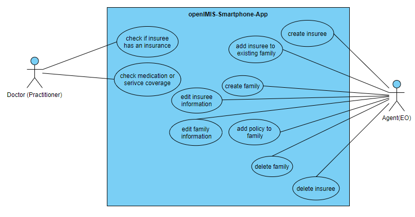

# Analysis for the openIMIS smartphone application


Responsible: Joel Staubach, Alexander Kravatzky, Floris Wittner

This guideline aims to document the terms, requirements and interfaces for the openIMIS smartphone application to be developed in order to provide an overview of the application to be developed.

[Presentation](OpenIMISAnalysis.pdf)

**Table of contents**

1. [Analysis for the openIMIS smartphone application](#analysis-for-the-openimis-smartphone-application)
   1. [Terms](#terms)
      1. [Insured](#insured)
      2. [Family](#family)
      3. [Insurance policy](#insurance-policy)
      4. [Coverage Eligbility](#coverage-eligbility)
   2. [Rolls](#rolls)
      1. [Agent](#agent)
      2. [Doctor](#doctor)
   3. [Requirements](#requirements)
      1. [Must criteria](#must-criteria)
      2. [Target criteria](#target-criteria)
      3. [Optional criteria](#optional-criteria)
   4. [Examples from openIMIS](#examples-from-openimis)
      1. [Create family](#create-family)
      2. [Create a new insured person for a family](#create-a-new-insured-person-for-a-family)
      3. [View insurance status](#view-insurance-status)
   5. [Interfaces](#interfaces)
      1. [openIMIS Patient](#openimis-patient)
      2. [Group](#group)
      3. [Coverage](#coverage)
      4. [Contract](#contract)
      5. [CoverageEligbility (Request/Response)](#coverageeligbility-requestresponse)
      6. [Login](#login)
      7. [ActivityDefinition (Medical Service)](#activitydefinition-medical-service)
      8. [Medication](#medication)
      9. [Location](#location)
      10. [Insurance Plan (Product)](#insurance-plan-product)
   6. [Proposals for the course of development](#proposals-for-the-course-of-development)

## Terms

The following definitions help to better understand the content of the documentation.

### Insured

Insured persons (insurees) are persons who can receive insurance benefits in the form of certain medical services.

### Family

A family (families) consists of several insured persons. Each family has a head of family.

### Insurance policy

The insurance policy is a contract between the insured and the insurers. In this scenario, the insurance company is openIMIS itself.

### Coverage Eligbility

An insured person is entitled to an insurance benefit (Coverage Eligbility) as soon as a specialist medical service (e.g. operations or medication) is covered by the insurance policy.

## Rolls

Based on the [RFP](https://moodle.hs-mannheim.de/pluginfile.php/354909/mod_resource/content/2/01_intro.pdf#page=21) and the [Google Summer Project](https://openimis.atlassian.net/wiki/spaces/OP/pages/3223519233/Google+Summer+of+Code+2022#PROJECT:-NEW-MOBILE-APPS), there are two types of roles that need to interact with the smartphone application and have different requirements for the system.

### Agent

Agents (Enrollment Officers) are persons who can create, view and edit families and insured persons. They can view all policies for insured persons, but cannot edit or create them.

### Doctor

A Doctor is a practitioner of a health facility. He is able to verify the eligibility of his patients (insured persons) and to prescribe medical services or medication accordingly.

## Requirements

The following use case diagram shows the individual tasks that can be performed by Doctors or Agents.


All use cases can only be carried out after the appropriate login mechanism has been used to check authorisation.

### Must criteria

The following criteria must be implemented to ensure the intended basic functionality of the app. These include the three use cases `check if insuree has an insurance`, `create insuree` and `add insuree to existing family` as well as offline availability, use in case of weak connection and support of different languages.

#### F1 - Create insuree

As an [Agent], I want to be able to create insureds to add new insureds to the system.

##### Fit criterion

As [Agent], I log in to the smartphone application with the appropriate login data. After logging in, I am given the option to create a new insured person. When selecting the option, a view appears in which I can add and save a new insured person with the necessary data (policy number, name, date of birth).

##### Necessary mandatory attributes

- Insurance number
- Name
- First names
- Date of birth

##### Required interfaces

- [Login]
- [Patient]

#### F2 - Add insuree to existing family

As an [Agent], I want to be able to add an insured to an existing family to add them to an insurance policy.

##### Fit criterion

As [Agent], I log in to the Smarpthone application with the appropriate credentials. After logging in, I receive a list of already registered families. After selecting a family, I can add an insured person to this family. I can select the insured person from the list of insured persons by their insurance number or name.

##### Mandatory attributes

- Insurance number or name

##### Required interfaces

- [Patient]
- [Group]

#### F3 -Check if insuree has an insurance

As a [Doctor], I want to see if a patient has insurance to be allowed to treat them.

##### Fit criterion

As [Doctor], I log in to the Smarpthone application with the appropriate credentials. I am then given the option to enter a patient's insurance number to see if they are a member of an insurance scheme.

##### Mandatory attributes

- Insurance number

##### Required interfaces

- [Login]
- [CoverageEligibility]

#### F4 - Offline availability

As [Doctor] and [Agent], I would like to be able to use the functions of the application offline, after logging in for the first time.

##### Fit criterion

If I have already logged in once as [Doctor] or [Agent], I can also log in to the app offline. All functions of the app can be used and all actions that involve saving to servers are cached locally and sent when an internet connection occurs.

#### F5 - Use with weak connection

As a [Doctor] and [Agent], I want to be able to store my data securely even when the internet connection is weak.

##### Fit criterion

When I, as a [Doctor] or [Agent], create new data that needs to be stored on the servers, it remains in the local memory until a storage on the server has been successfully performed.

#### F6 -support of different languages

As a [Doctor] and [Agent], I want to be able to change the language of the application to better understand the content.

##### Fit criterion

As [Doctor] and [Agent], I get a choice of at least two possible languages (German, English), which I can select via the operating system language of my smartphone. If the language is not supported, German is used.

### Target criteria

The following criteria should be implemented to improve the use of the app. However, failure to meet these criteria does not lead to failure of the project. Specifically, this includes the use cases `check medication or service coverage`, `create family`, `edit insuree information`, `edit family information` and `add policy to family`.

#### F7 - Create Family

As an [Agent], I would like to be able to create a family so that I can include people in the insurance.

##### Fit criterion:

As [Agent], I log in to the Smarpthone application with the appropriate credentials. After logging in, I get a list of already registered families and the option to create a new family. I select this option and get a view to create a new family. I have to enter at least the address of the family (Region, District, Municipality, Village) and create or select an insured person who will be the head of the family. After entering the necessary data, I can save the family and it appears in the list of available families.

##### Mandatory attributes

- Region
- District
- Municipality
- Village
- Head insuree

##### Required interfaces

- [Group]
- [Patient]

#### F8 - Edit family information

As [Agent], I want to edit a family to change family-relevant (e.g. the address) information.

##### Fit criterion:

As [Agent], I log in to the Smarpthone application with the appropriate credentials. After logging in, I get a list of the families that are already registered. I select a family and get a view with all the information about that family. From the view, I can change and save the family details (e.g. address). This does not include adding and removing an insured person from the family.

##### Mandatory attributes

- Region
- District
- Municipality
- Village

##### Required interfaces

- [Group]

#### F9 - Edit insuree information

As an [Agent], I want to be able to edit policy details to make changes to a policyholder's personal information.

##### Fit criterion

As [Agent], I log in to the smartphone application with the appropriate credentials. After logging in, I am given the option to view a list of insured persons. After selecting an insured person from the list, I get a view to change and save the personal information.

##### Mandatory attributes

- Name
- Surname
- Date of birth

##### Required interfaces

- [Patient]
- [Location]

#### F10 - Add policy fo family

As an [Agent], I want to add an insurance policy to insure a family.

##### Fit criterion:

As [Agent], I log in to the Smarpthone application with the appropriate credentials. After logging in, I get a list of the families that are already registered. I select a family and get a view with all the information about that family. There I get the possibility to create a new insurance policy for the whole family. I can choose from a number of approved insurance plans.

##### Mandatory attributes

- Insurance plan
- Contribution

##### Required interfaces

- [Group]
- [Coverage]
- [Contract]
- [InsurancePlan]

#### F11 - Check medication or service coverage

As a [Doctor], I want to be able to see a patient's insurance status to check if medication or services are covered by insurance.

##### Fit criterion

As [Doctor], I log in to the Smarpthone application with the appropriate credentials. I am then given the option to enter a patient's policy number to get information about the insurance. In addition, I can choose from a list of medicines or services to check directly whether they are covered by the insurance.

##### Mandatory attributes

- Insurance number

##### Required interfaces

- [CoverageEligibility]
- [Medication]
- [ActivityDefinition]

### Optional criteria

The following requirements would round off the functional scope of the application and increase user-friendliness. These specifically include the use cases `delete family` and `delete insuree`.

#### F12 - Delete family

As [Agent], I want to remove a family to delete it from the system.

##### Fit criterion:

As [Agent], I log in to the Smarpthone application with the appropriate credentials. After logging in, I get a list of the families that are already registered. I select a family and get a view with all the information about that family. I then get the option to delete the families irrevocably. After the process is completed, the family no longer appears in the list of all families.

##### Mandatory attributes

- None

##### Required interfaces

- [Group]

#### F13 - Delete insuree

As [Agent](#agent), I want to be able to delete an insured to remove them from the system.

##### Fit criterion

As [Agent](#agent), I log in to the smarpthone application with the appropriate credentials. After logging in, I am given the option to view a list of insured persons. After selecting an insured person from the list, I get a view with all personal information of the insured person. I am then given the option to irrevocably delete the insured person. After the process is completed, the insured person no longer appears in the list of all insured persons.

##### Mandatory attributes

- None

##### Required interfaces

- [Group]

## Examples from openIMIS

The openIMIS web application already implements most of the use cases for the smartphone application. In the following, these scenarios are carried out in the openIMIS application in order to gain an understanding of the necessary information. All scenarios start with the login via the URL `https://release.openimis.org/front/login`.

### Create family

First, the input data of an Enrolment Officer is entered (username: E00005, password: E00005E00005). The EO clicks on the tab `insurees and Policies`. This opens a drop-down menu in which he selects `Add Family/Group`. A new view opens in which he can enter data about the family and a family head. After entering the data, the EO can save it with a button in the lower right corner. If he now selects the item `Families/Groups` under `Insurees and Policies`, the new family is displayed.

### Create a new insured person for a family

First, the input data of an Enrolment Officer is entered (username: E00005, password: E00005E00005). The EO clicks on the tab `Insurees and Policies`. This opens a drop-down menu in which he selects `Family/Groups`. There he searches for the family for which he wants to create an insured person and clicks on it. A new view opens in which he can change the data of the family or add and remove insured persons. He presses the `+` symbol in the right-hand corner of the `Insurees` card. This opens a new card in which a new insured person can be created. After entering the data, he can save the insured person in the lower right corner. If he now returns to the family via the upper left button, he sees the new insured person in the card `Insurees`.

### View insurance status

First the input data of a Doctor are entered (these do not exist at present, therefore admin data). The EO clicks on the tab `Insurees and Policies`. This opens a drop-down menu in which he selects `Insurees`. There he can select the insured person for whom he wants to check the insured status. After clicking on the search icon, a map opens with all insurance policies that exist for the insured person. In addition, he can use Service Eligibility and Item Eligibility to enter the medical services and medicines for which he wants to check whether the services are covered by one of the insurance policies. A thumbs up means that the service is available, while a thumbs down means that the service is not covered by any insurance policy.

## Interfaces

The following interfaces are relevant to fill the application with the required data. Each resource has an identifier. An example of such an identifier is `40CE0BA2-51AC-4C20-BC11-9779297FE91F`.

The base URL to the API endpoint in the release is: https://release.openimis.org/api/api_fhir_r4/

### openIMIS Patient

The resource [openIMIS Patient](http://fhir.openimis.org/StructureDefinition-openimis-patient.html) is used to manage insured persons. The interface is derived from the FHIR interface [Patient](http://hl7.org/fhir/R4/patient.html). A patient can basically be created without a family, but in order to give them an insurance policy, the entire [enrolment process] must be carried out. Patients have a unique ID (insurance number). However, this is not the ID for accessing the resource.

#### Relevant HTTP verbs

- GET (Read Insured)
- PUT/PATCH (Change Insured)
- POST (Create Insured)
- DELETE (deletion of insured persons)

#### Further resources

- Entry point in the release: https://release.openimis.org/api/api_fhir_r4/Patient
- [Enrollment Process]
- [openIMIS Patient](http://fhir.openimis.org/StructureDefinition-openimis-patient.html)
- [Patient](http://hl7.org/fhir/R4/patient.html)
- [Postman-Workspace](https://www.postman.com/security-cosmologist-70238230/workspace/openimis-api/folder/20519604-a99c509a-5bf1-4459-864b-8d638a8c94b1?ctx=documentation)

### Group

The [openIMIS Group] resource is used to manage families. The interface is derived from the FHIR interface [Group]. A family needs at least one family member representing the head of the family. Insurance policies can be added for families. Families often need a CHFID for requests. This is the ID of the head of the family.

#### Relevant HTTP verbs

- GET (Reading Families)
- PUT/PATCH (change families)
- POST (Creating Families)
- DELETE (Deletion of families)

#### Further resources

- Entry point in the release: https://release.openimis.org/api/api_fhir_r4/Group
- [openIMIS Group]
- [Group](http://hl7.org/fhir/R4/patient.html)
- [Group]

### Coverage

The [openIMIS Coverage] resource contains the information about the insurance policy, the start and end of the policy and references to the beneficiaries. It is derived from the FHIR interface [Coverage] It can be used to ensure that a person has an insurance policy, but not what is covered by it. This resource cannot be created via an HTTP call, but is created via a contract.

#### Relevant HTTP verbs

- GET (Read Policy)

#### Further resources

- Entry point in the release: https://release.openimis.org/api/api_fhir_r4/Coverage
- [openIMIS Coverage]
- [Coverage]
- [Coverage examples]

### Contract

The [openIMIS Contract] resource is needed to conclude a contract with an insurance policy and a family. It is derived from the FHIR interface [Contract].

#### Relevant HTTP verbs

- GET (read the contracts)
- POST (Create Contracts)

#### Further resources

- Entry point in the release: https://release.openimis.org/api/api_fhir_r4/Contract
- [openIMIS Contract]
- [Contract]
- [Contract examples]

### CoverageEligbility (Request/Response)

The resource [openIMIS CoverageEligbilityRequest] is needed to check whether certain medical services or medicines are covered by an insured person's policy. It is derived from the FHIR interface [CoverageEligbilityRequest]. The response is a resource of the type [openIMIS CoverageEligbilityResponse]. In the [Enquire process], the medicines and services are received and the [CoverageEligbilityRequest] is then sent.

#### Relevant HTTP verbs

- POST (Create a new EligibilityRequest)

#### Further resources

- Entry point in the release: https://release.openimis.org/api/api_fhir_r4/CoverageEligibilityRequest
- [openIMIS CoverageEligbilityRequest]
- [openIMIS CoverageEligbilityResponse]
- [CoverageEligbilityRequest]
- [CoverageEligbilityResponse]
- [Enquire process]
- [CoverageEligbility examples]

### Login

JWT authentication is used to log in to openIMIS with a specific role. This generates a token that is passed in the HTTP header `Authorization: Bearer <Token>`. The token is passed via the login interface with the following body content.
`{ "username": < username> "password": < password> }`

Another method is to use `Basic Auth` authorisation headers. For this, the user name and password are encoded in Base64 and passed into the `Authorisation` header. The format of the encoding looks like this:

```
base64Encode('$username:$password')
```

#### Relevant HTTP verbs

- POST (Create a Login Call)

#### Further resources

- Entry point in the release: https://release.openimis.org/api/api_fhir_r4/login/
- [openIMIS Authentification]
- [Authentification examples]

### ActivityDefinition (Medical Service)

The resource [openIMIS ActivityDefinition] is used to represent a medical service. The resource is derived from the FHIR interface [ActivityDefinition]. For the Smarpthone application, the resource is needed to allow Doctors to check their patients eligibility for certain services.

#### Relevant HTTP verbs

- GET (Read medical performance)

#### Further resources

- Entry point in the release: https://release.openimis.org/api/api_fhir_r4/ActivityDefinition/
- [openIMIS ActivityDefinition]
- [ActivityDefinition]
- [ActivityDefinition examples]

### Medication

The [openIMIS Medication] resource is used to obtain available medications. The resource is derived from the FHIR interface [Medication]. For the smartphone application, the resource is needed to enable Doctors to check their patients' eligibility for certain medications.

#### Relevant HTTP verbs

- GET (Read the medicine)

#### Further resources

- Entry point in the release: https://release.openimis.org/api/api_fhir_r4/ActivityDefinition/
- [openIMIS Medication]
- [Medication]
- [Medication examples]

### Location

The resource [openIMIS Location] is used to represent locations. The resource is derived from the FHIR interface [Location]. For the smartphone application, the resource is needed to change all available locations for the residence of a family, or a single person.

#### Relevant HTTP verbs

- GET (read the places)

#### Further resources

- Entry point in the release: https://release.openimis.org/api/api_fhir_r4/Location/
- [openIMIS Location]
- [Location]
- [Location examples]

### Insurance Plan (Product)

The [openIMIS Insurance Plan] resource is used to manage the possible insurance plans. The resource is derived from the FHIR interface [InsurancePlan]. For the smartphone application, the resource is needed to be able to select all possible insurance plans when creating an insurance contract.

#### Relevant HTTP verbs

- GET (Read Insurance Plans)

#### Further resources

- Entry point in the release: https://release.openimis.org/api/api_fhir_r4/InsurancePlan/
- [openIMIS Insurance Plan]
- [InsurancePlan]
- [InsurancePlan examples]

## Proposals for the course of development

In order to break down the development of the app into measurable sub-steps, the application should be prioritised according to the must, should and can criteria. The postman collection of the individual interfaces helps to gain an understanding of the use of the application. At the beginning of the application, it should only be possible to create the mandatory attributes for families or insured persons. More attributes can also be added later. We recommend using `Basic Auth` instead of `Bearer Token` for authentication.

[Agent]: #agent
[Doctor]: #doctor
[login]: #login
[patient]: #openimis-patient
[coverageeligibility]: #coverageeligbility-requestresponse
[enrollment process]: http://fhir.openimis.org/usecase-enrollment.html
[enquire process]: http://fhir.openimis.org/usecase-enquire.html
[openimis group]: http://fhir.openimis.org/StructureDefinition-openimis-group.html
[group]: http://hl7.org/fhir/R4/group.html
[group examples]: https://www.postman.com/security-cosmologist-70238230/workspace/openimis-api/folder/20519604-d3a413dd-7e27-4df5-b873-e21c26bd2d67
[openimis coverage]: http://fhir.openimis.org/StructureDefinition-openimis-coverage.html
[coverage]: http://hl7.org/fhir/R4/coverage.html
[coverage examples]: https://www.postman.com/security-cosmologist-70238230/workspace/openimis-api/folder/20519604-6b21ab54-92bd-4c45-80ad-e57ed2389e82?ctx=documentation
[openimis contract]: http://fhir.openimis.org/StructureDefinition-openimis-contract.html
[contract]: http://hl7.org/fhir/R4/contract.html
[contract examples]: https://www.postman.com/security-cosmologist-70238230/workspace/openimis-api/folder/20519604-ea0de329-38e7-4218-9194-87a6fe47962d?ctx=documentation
[openimis coverageeligbilityrequest]: http://fhir.openimis.org/StructureDefinition-openimis-coverage-eligibility-request.html
[openimis coverageeligbilityresponse]: http://fhir.openimis.org/StructureDefinition-openimis-coverage-eligibility-response.html
[coverageeligbilityrequest]: http://hl7.org/fhir/R4/coverageeligibilityrequest.html
[coverageeligbilityresponse]: http://hl7.org/fhir/R4/coverageeligibilityresponse.html
[coverageeligbility examples]: https://www.postman.com/security-cosmologist-70238230/workspace/openimis-api/folder/20519604-ce2a93f5-aa25-4e53-a24b-1f06b7afa610?ctx=documentation
[openimis authentification]: http://fhir.openimis.org/security.html
[Authentification examples]: https://www.postman.com/security-cosmologist-70238230/workspace/openimis-api/folder/20519604-e599eb39-bf12-4e3f-9a47-332edae7088f?ctx=documentation
[openimis activitydefinition]: http://fhir.openimis.org/StructureDefinition-openimis-activitiy-definition.html
[activitydefinition]: http://hl7.org/fhir/R4/activitydefinition.html
[activitydefinition examples]: https://www.postman.com/security-cosmologist-70238230/workspace/openimis-api/folder/20519604-4657beed-7093-4434-8110-2124999d4fc0?ctx=documentation
[openimis medication]: http://fhir.openimis.org/StructureDefinition-openimis-medication.html
[medication]: http://hl7.org/fhir/R4/medication.html
[medication examples]: https://www.postman.com/security-cosmologist-70238230/workspace/openimis-api/folder/20519604-02fbe3c0-f7cf-4738-b5a0-97d9b1e599fb?ctx=documentation
[openimis location]: http://fhir.openimis.org/StructureDefinition-openimis-location.html
[location]: http://hl7.org/fhir/R4/location.html
[location examples]: https://www.postman.com/security-cosmologist-70238230/workspace/openimis-api/folder/20519604-7934c1e8-e013-4986-b3f0-153b6bb41b83?ctx=documentation
[openimis insurance plan]: http://fhir.openimis.org/StructureDefinition-openimis-insurance-plan.html
[insuranceplan]: http://hl7.org/fhir/R4/insuranceplan.html
[insuranceplan examples]: https://www.postman.com/security-cosmologist-70238230/workspace/openimis-api/folder/20519604-7e6cec4f-bfd6-4b7c-adc6-e5318d011950?ctx=documentation
[base_url]: https://release.openimis.org/api/api_fhir_r4/


