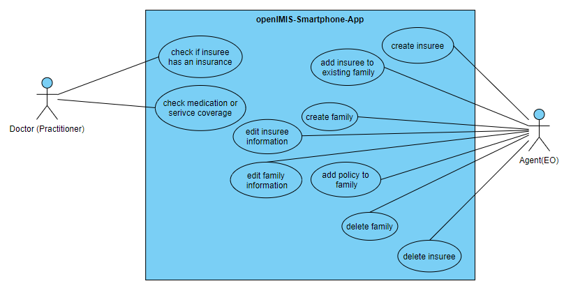

# Analyse für die openIMIS-Smartphone-Anwendung

Verantwortlicher: Joel Staubach, Alexander Kravatzky, Floris Wittner

Dieses Dokument hat zum Ziel die Begriffe, Anforderungen und Schnittstellen für die zu entwickelnde openIMIS-Smartphone-Awendung zu dokumentieren, um einen Überblick über die zu entwickelnde Anwendung zu geben.

[Präsentation](OpenIMISAnalyse.pdf)

**Inhaltsverzeichnis**

1.  [Begriffe](#begriffe)
    1. [Versicherter](#versicherter)
    2. [Familie](#familie)
    3. [Versicherungspolice](#versicherungspolice)
    4. [Anspurchsberechtigung](#anspurchsberechtigung)
2.  [Rollen](#rollen)
    1. [Agent](#agent)
    2. [Arzt](#arzt)
3.  [Anforderungen](#anforderungen)
    1. [Muss-Kriterien](#muss-kriterien)
    2. [Soll-Kriterien](#soll-kriterien)
    3. [Kann-Kriterien](#kann-kriterien)
4.  [Beispiele aus openIMIS](#beispiele-aus-openimis)
    1. [Familie erstellen](#familie-erstellen)
    2. [Neuen Versicherten für eine Familie erstellen](#neuen-versicherten-für-eine-familie-erstellen)
    3. [Versicherungsstatus einsehen](#versicherungsstatus-einsehen)
5.  [Schnittstellen](#schnittstellen)
    1. [openIMIS Patient](#openimis-patient)
    2. [Group](#group)
    3. [Coverage](#coverage)
    4. [Contract](#contract)
    5. [CoverageEligbility (Request/Response)](#coverageeligbility-requestresponse)
    6. [Login](#login)
    7. [ActivityDefinition (Medical Service)](#activitydefinition-medical-service)
    8. [Medication](#medication)
    9. [Location](#location)
    10. [Insurance Plan (Product)](#insurance-plan-product)
6.  [Vorschläge zum Entwicklungsverlauf](#vorschläge-zum-entwicklungsverlauf)

## Begriffe

Die folgenden Begriffsdefintionen helfen den Inhalt der Dokumentation besser zu verstehen.

### Versicherter

Versicherte (insurees) sind Personen, die Versicherungsleistungen erhalten können in Form von bestimmten medizinischen Leistungen erhalten können.

### Familie

Eine Familie (Families) besteht aus mehreren Versicherten. Jede Familie besitzt ein Familienoberhaupt.

### Versicherungspolice

Die Versicherungspolice ist ein Vertrag zwischen den Versicherten und den Versicherern. In diesem Szenario ist das Versicherungsunternehmen openIMIS selbst.

### Anspurchsberechtigung

Eine Anspruchsberechtigung für eine Versicherungsleistung (Coverage Eligbility) besteht für Versicherte, sobald eine medizinische Fachleistung (z.b. Operationen oder Medikationen) von der Versicherungspolice abgedeckt wird.

## Rollen

Es gibt anhand der [Ausschreibung](https://moodle.hs-mannheim.de/pluginfile.php/354909/mod_resource/content/2/01_intro.pdf#page=21) und dem [Google Summer Project](https://openimis.atlassian.net/wiki/spaces/OP/pages/3223519233/Google+Summer+of+Code+2022#PROJECT:-NEW-MOBILE-APPS) zwei Rollentypen, welche mit der Smartphone-Anwendung interagieren müssen und unterschiedliche Anforderungen an das System haben.

### Agent

Agenten (Enrollment Officers) sind Personen, die Familien und Versicherte anlegen, einsehen und bearbeiten können. Sie können alle Versicherungspolicen für Versicherte einsehen, jedoch nicht bearbeiten oder Erstellen.

### Arzt

Ein Arzt ist ein Praktizierender (Practitioner) einer Gesundheitseinrichtung. Er ist in der Lage, die Anspruchsberechtigung von seinen Patienten (Versicherte) zu überprüfen und dementsprechende medizinische Leistungen (Medical Services) oder Medikamente (Medication) zu verordnen.

## Anforderungen

Das folgende Use-Case-Diagramm zeigt die einzelnen Aufgaben, welche von Ärzten oder Agenten durchgeführt werden können.


Alle Anwendungsfälle können nur nach dem entsprechenden Login-Mechanismus zur Prüfung der Berechtigung durchgeführt werden.

### Muss-Kriterien

Die folgenden Kriterien müssen umgesetzt werden, um die gewollte Basis-Funktionalität der App zu gewährleisten. Dazu gehören die drei Anwendungsfälle `check if insuree has an insurance`, `create insuree` und `add insuree to existing family` sowie die Offline-Verfügbarkeit, Nutzung bei schwacher Verbindung und die Unterstützung verschiedener Sprachen .

#### F1 - Create insuree

Als [Agent] möchte ich Versicherte erstellen können, um neue Versicherte in das System hinzuzufügen.

##### Fit-Kriterium

Als [Agent] melde ich mich mit den entsprechenden Anmeldedaten in der Smarpthone-Anwendung an. Nachdem die Anmeldung erfolgt ist, erhalte ich die Möglichkeit einen neuen Versicherten anzulegen. Beim Auswählen der Option erscheint eine Ansicht, in der ich einen neuen Versicherten mit den notwendigen Daten (Versicherungsnummer, Name, Geburtsdatum) hinzufügen und speichern kann.

##### Notwendige Pflichtattribute

- Versicherungsnummer
- Name
- Vornamen
- Geburtsdatum

##### Benötigte Schnittstellen

- [Login]
- [Patient]

#### F2 - Add insuree to existing family

Als [Agent] möchte ich einen Versicherten zu einer bereist existierenden Familie hinzufügen können, um ihn zu einer Versicherung hinzuzufügen.

##### Fit-Kriterium

Als [Agent] melde ich mich mit den entsprechenden Anmeldedaten in der Smarpthone-Anwendung an. Nachdem die Anmeldung erfolgt ist, erhalte ich eine Liste mit den bereits registrierten Familien. Nach Auswahl einer Familie bin ich in der Lage einen Versicherten zu dieser Familie hinzuzufügen. Dabei kann ich den Versicherten anhand seiner Versicherungsnummer oder dem Namen aus der Liste von Versicherten auswählen.

##### Pflichtattribute

- Versicherungsnummer oder Name

##### Benötigte Schnittstellen

- Patient
- Group

#### F3 -Check if insuree has an insurance

Als [Arzt] möchte ich sehen, ob ein Patient eine Versicherung hat, um ihn behandeln zu dürfen.

##### Fit-Kriterium

Als [Arzt] melde ich mich mit den entsprechenden Anmeldedaten in der Smarpthone-Anwendung an. Daraufhin erhalte ich die Möglichkeit, die Versicherungsnummer eines Patienten einzugeben, um zu sehen, ob dieser Mitglied einer Versicherung ist.

##### Pflichtattribute

- Versicherungsnummer

##### Benötigte Schnittstellen

- [Login]
- [CoverageEligibility]

#### F4 - Offline-Verfügbarkeit

Als [Arzt] und [Agent] möchte ich Offline, nach erstmaligem Login, die Möglichkeit erhalten, die Funktionen der Anwendung zu nutzen.

##### Fit-Kriterium

Wenn ich mich als [Arzt] oder [Agent] bereits einmal angemeldet habe, kann ich mich auch Offline in der App anmelden. Alle Funktionen der App lassen sich verwenden und alle Aktionen, die das Speichern auf Servern beinhalten, werden lokal zwischengespeichert und bei Eintreten einer Internetverbindung abgeschickt.

#### F5 - Nutzung bei schwacher Verbindung

Als [Arzt] und [Agent] möchte ich auch bei schwacher Internetverbindung meine Daten sicher speichern können.

##### Fit-Kriterium

Wenn ich als [Arzt] oder [Agent] neue Daten, die auf den Servern gespeichert werden müssen, erstelle, bleiben diese so lange im lokalen Speicher, bis eine Speicherung auf dem Server erfolgreich durchgeführt wurde.

#### F6 -Unterstützung verschiedener Sprachen

Als [Arzt] und [Agent] möchte ich die Sprache der Anwendung verändern können, um die Inhalte besser zu verstehen.

##### Fit-Kriterium

Als [Arzt] und [Agent] erhalte ich eine Auswahl von mindestens zwei möglichen Sprachen (Deutsch, Englisch), welche ich über die Betriebssystemsprache meines Smartphones auswählen kann. Falls die Sprache nicht unterstützt wird, wird Deutsch verwendet.

### Soll-Kriterien

Die folgenden Kriterien sollten umgesetzt werden, um die Nutzung der App zu verbesseren. Das nicht Erfüllen dieser Kriterien führt jedoch nicht zum Scheitern des Projekts. Konkret beinhaltet dies die Anwendungsfälle `check medication or service coverage`, `create family`, `edit insuree information`, `edit family information` und `add policy to family`.

#### F7 - Create Family

Als [Agent] möchte ich eine Familie erstellen können, um die Personen in die Versicherung aufnehmen zu können.

##### Fit-Kriterium:

Als [Agent] melde ich mich mit den entsprechenden Anmeldedaten in der Smarpthone-Anwendung an. Nachdem die Anmeldung erfolgt ist, erhalte ich eine Liste mit den bereits registrierten Familien und die Möglichkeit eine neue Familie zu erstellen. Ich wähle diese Möglichkeit aus und erhalte eine Ansicht zum Anlegen einer neuen Familie. Dabei muss ich mindestens die Anschrifft der Familie angeben (Region, District, Municipality, Village) und einen Versicherten erstellen, oder auswählen, welcher das Familienoberhaupt darstellt. Nach Eingabe der notwendigen Daten sind, kann ich die Familie speichern und sie erscheint in der Liste der verfügbaren Familien.

##### Pflichtattribute

- Region
- District
- Municipality
- Village
- Head insuree

##### Benötigte Schnittstellen

- Group
- Patient

#### F8 - Edit family information

Als [Agent] möchte ich eine Familie bearbeiten, um Familien-relevante (z.B. die Adresse) Informationen zu verändern.

##### Fit-Kriterium:

Als [Agent] melde ich mich mit den entsprechenden Anmeldedaten in der Smarpthone-Anwendung an. Nachdem die Anmeldung erfolgt ist, erhalte ich eine Liste mit den bereits registrierten Familien. Ich wähle eine Familie aus und erhalte eine Ansicht mit allen Informationen zu dieser Familie. Über die Ansicht kann ich die Familiendetails (z.B. Adresse) ändern und speichern. Dazu gehört nicht das Hinzufügen und Entfernen eines Versicherten von der Familie.

##### Pflichtattribute

- Region
- District
- Municipality
- Village

##### Benötigte Schnittstellen

- Group

#### F9 - Edit insuree information

Als [Agent] möchte ich Versichertendetails bearbeiten können, um Änderungen an den persönlichen Informationen eines Versicherten vorzunehmen.

##### Fit-Kriterium

Als [Agent] melde ich mich mit den entsprechenden Anmeldedaten in der Smarpthone-Anwendung an. Nachdem die Anmeldung erfolgt ist, erhalte ich die Möglichkeit eine Liste von versicherten einzusehen. Nach Auswahl eines Versicherten aus der Liste erhalte ich eine Ansicht zum Ändern und Speichern der persönlichen Informationen.

##### Pflichtattribute

- Name
- Nachname
- Geburtsdatum

##### Benötigte Schnittstellen

- Patient
- Location

#### F10 - Add policy fo family

Als [Agent] möchte ich eine Versicherungspolice zu einer Familie hinzufügen, um eine Familie zu versichern.

##### Fit-Kriterium:

Als [Agent] melde ich mich mit den entsprechenden Anmeldedaten in der Smarpthone-Anwendung an. Nachdem die Anmeldung erfolgt ist, erhalte ich eine Liste mit den bereits registrierten Familien. Ich wähle eine Familie aus und erhalte eine Ansicht mit allen Informationen zu dieser Familie. Dort erhalte ich die Möglichkeit eine neue Versicherungspolice für die gesamte Familie anzulegen. Dabei kann ich von einer Menge an zugelassenen Versicherungsplänen wählen.

##### Pflichtattribute

- Versicherungsplan
- Beitrag

##### Benötigte Schnittstellen

- Group
- Coverage
- Contract
- InsurancePlan

#### F11 - Check medication or service coverage

Als [Arzt] möchte ich den Versicherungsstatus eines Patienten einsehen können, um zu prüfen, ob Medikation oder Dienstleistungen von der Versicherung abgedeckt werden.

##### Fit-Kriterium

Als [Arzt] melde ich mich mit den entsprechenden Anmeldedaten in der Smarpthone-Anwendung an. Daraufhin erhalte ich die Möglichkeit, die Versicherungsnummer eines Patienten einzugeben, um Informationen zur Versicherung zu erhalten. Zusätzlich kann ich aus einer Liste von Medikamenten oder Dienstleistungen wählen, um direkt zu prüfen, ob diese von der Versicherung abgedeckt werden.

##### Pflichtattribute

- Versicherungsnummer

##### Benötigte Schnittstellen

- [CoverageEligibility]
- [Medication]
- AcivityDefinition

### Kann-Kriterien

Die folgenden Anforderungen würden den Funktionsumfang der Anwendung abrunden und die Nutzerfreundlichkeit erhöhen. Dazu zählen konkret die Anwendungsfälle `delete family` und `delete insuree`.

#### F12 - Delete family

Als [Agent] möchte ich eine Familie entfernen, um sie aus dem System zu löschen.

##### Fit-Kriterium:

Als [Agent] melde ich mich mit den entsprechenden Anmeldedaten in der Smarpthone-Anwendung an. Nachdem die Anmeldung erfolgt ist, erhalte ich eine Liste mit den bereits registrierten Familien. Ich wähle eine Familie aus und erhalte eine Ansicht mit allen Informationen zu dieser Familie. Daraufhin erhalte ich die Möglichkeit die Familien unwiderruflich zu löschen. Nachdem der Vorgang abgeschlossen ist, taucht die Familie nicht mehr in der Liste alle Familien auf.

##### Pflichtattribute

- Keine

##### Benötigte Schnittstellen

- Group

#### F13 - Delete insuree

Als [Agent](#agent) möchte ich einen Versicherten löschen können, um ihn aus dem System zu entfernen.

##### Fit-Kriterium

Als [Agent](#agent) melde ich mich mit den entsprechenden Anmeldedaten in der Smarpthone-Anwendung an. Nachdem die Anmeldung erfolgt ist, erhalte ich die Möglichkeit eine Liste von versicherten einzusehen. Nach Auswahl eines Versicherten aus der Liste erhalte ich eine Ansicht mit allen persönlichen Informationen des Versicherten. Daraufhin erhalte ich die Möglichkeit den Versicherten unwiderruflich zu löschen. Nachdem der Vorgang abgeschlossen ist, taucht der Versicherte nicht mehr in der Liste aller Versicherter auf.

##### Pflichtattribute

- Keine

##### Benötigte Schnittstellen

- Group

## Beispiele aus openIMIS

Die openIMIS-Webanwendung setzt die meisten Anwendungsfälle für die Smarpthone-Anwendung bereits um. Im Folgenden werden diese Szernarien in der openIMIS-Anwendun durchgeführt um ein Verständis für die notwendigen Informationen zu erhalten. Alle Szenarien beginnen über die URL `https://release.openimis.org/front/login` mit dem Login.

### Familie erstellen

Zuerst werden die Eingabedaten eines Enrolment-Officers eingegeben (username: E00005, password: E00005E00005). Der EO klickt auf den Reiter `Insurees and Policies`. Daraufhin öffnet sich ein Drop-Down-Menü in welchem er `Add Family/Group` auswählt. Es öffnet sich eine neue Ansicht in, welcher er Daten zur Familie, sowie ein Familienoberhaupt anlegen kann. Nach der Eingabe der Daten kann der EO diese mit einem Button in der unteren rechten Ecke speichern. Wenn er nun unter `Insurees and Policies` das Item `Families/Groups` auswählt, wird die neue Familie angezeigt.

### Neuen Versicherten für eine Familie erstellen

Zuerst werden die Eingabedaten eines Enrolment-Officers eingegeben (username: E00005, password: E00005E00005). Der EO klickt auf den Reiter `Insurees and Policies`. Daraufhin öffnet sich ein Drop-Down-Menü in welchem er `Family/Groups` auswählt. Dort sucht er die Familie, für die er einen Versicherten anlegen möchte und klickt diese an. Es öffnet sich eine neue Ansicht in, welcher er die Daten zur Familie ändern, oder Versicherte hinzufügen und entfernen kann. Er drückt auf das `+`-Symbol in der rechten Ecke der Karte `Insurees`. Daraufhin öffnet sich eine neue Karte, in der ein neuer Versicherter angelegt werden kann. Nach Eingabe der Daten kann er in der rechten unteren Ecke den Versicherten speichern. Wenn er nun über den linken oberen Button zur Familie zurückkehrt, sieht er den neuen Versicherten in der Karte `Insurees`.

### Versicherungsstatus einsehen

Zuerst werden die Eingabedaten eines Arzters eingegeben (die gibt es derzeit nicht. Deshalb Admin-Daten). Der EO klickt auf den Reiter `Insurees and Policies`. Daraufhin öffnet sich ein Drop-Down-Menü in welchem er `Insurees` auswählt. Dort kann er den Versicherten auswählen, für den er den Versichertenstatus prüfen will. Nach dem anklicken des Such-Icons öffnet sich eine Karte mit allen Versicherungspolicen, die für den Versicherten existieren. Außerdem kann er dort über Service Eligibility und Item Eligibility, die medizinischen Leistungen und Medikamente eingeben, gegen welche geprüft werden soll, ob die Leistungen über eine der Versicherungspolicen abgedeckt wird. Ein Daumen nach oben, bedeutet, dass die Leistung vorhanden ist, während ein Daumen nach unten bedeutet, dass die Leistung über keine Versicherungspolice abgedeckt wird.

## Schnittstellen

Die folgenden Schnittstellen sind relevant um die Anwendung mit den benötigten Daten zu befüllen. Jede Ressource besitzt einen Identifier. Ein Beispiel für einen solchen Identifier ist `40CE0BA2-51AC-4C20-BC11-9779297FE91F`.

Die Basis-URL zum API-Endpunkt im Release lautet: https://release.openimis.org/api/api_fhir_r4/

### openIMIS Patient

Die Ressource [openIMIS Patient](http://fhir.openimis.org/StructureDefinition-openimis-patient.html) dient zum Verwalten von Versicherten. Die Schnittstelle ist von der FHIR-Schnittstelle [Patient](http://hl7.org/fhir/R4/patient.html) abgeleitet. Ein Patient kann grundsätzlich ohne Familie erstellt werden, um ihn jedoch eine Versicherungspolice zu vergeben, muss der gesamte [Enrollment-Prozess] durchgeführt werden. Patienten haben eine eindeutige ID (Versicherungsnummer). Diese ist jedoch nicht die ID für den Zugriff auf die Ressource.

#### Relevante HTTP-Verben

- GET (Lesen von Versicherten)
- PUT/PATCH (Verändern von Versicherten)
- POST (Erstellen von Versicherten)
- DELETE (Löschen von Versicherten)

#### Weitere Ressourcen

- Einstiegspunkt im Release: https://release.openimis.org/api/api_fhir_r4/Patient
- [Enrollment-Prozess]
- [openIMIS Patient](http://fhir.openimis.org/StructureDefinition-openimis-patient.html)
- [Patient](http://hl7.org/fhir/R4/patient.html)
- [Postman-Workspace](https://www.postman.com/security-cosmologist-70238230/workspace/openimis-api/folder/20519604-a99c509a-5bf1-4459-864b-8d638a8c94b1?ctx=documentation)

### Group

Die Ressource [openIMIS Group] dient zum Verwalten von Familien. Die Schnittstelle ist von der FHIR-Schnittstelle [Group] abgeleitet. Eine Familie brauch mindestens ein Familienmitglied, welches das Familienoberhaupt repräsentiert. Für Familien können Versicherungspolicen hinzugefügt werden. Familien brauchen bei Requests häufig eine CHFID. Diese ist die ID des Familienoberhaupts.

#### Relevante HTTP-Verben

- GET (Lesen von Familien)
- PUT/PATCH (Verändern von Familien)
- POST (Erstellen von Familien)
- DELETE (Löschen von Familien)

#### Weitere Ressourcen

- Einstiegspunkt im Release: https://release.openimis.org/api/api_fhir_r4/Group
- [openIMIS Group]
- [Group](http://hl7.org/fhir/R4/patient.html)
- [Group-Beispiele]

### Coverage

Die Ressource [openIMIS Coverage] beinhaltet die Informationen über die Versicherungspolice, dem Beginn und Ende der Police sowie Referenzen zu den begünstigten Personen. Sie ist abgeleitet von der FHIR-Schnitstelle [Coverage] Mit ihr kann sichergestellt werden, dass eine Person eine Versicherungspolice hat, jedoch nicht, was durch diese abgedeckt wird. Diese Ressource kann nicht über einen HTTP-Aufruf erstellt werden, sondern wird über einen Vertrag (Contract) erstellt.

#### Relevante HTTP-Verben

- GET (Lesen der Police)

#### Weitere Ressourcen

- Einstiegspunkt im Release: https://release.openimis.org/api/api_fhir_r4/Coverage
- [openIMIS Coverage]
- [Coverage]
- [Coverage-Beispiele]

### Contract

Die Ressource [openIMIS Contract] wird benötigt, um einen Vetrag mit einer Versicherungspolice und einer Familie abzuschließen. Sie wird von der FHIR-Schnitstelle [Contract] abgeleitet.

#### Relevante HTTP-Verben

- GET (Lesen der Verträge)
- POST (Erstellen von Verträgen)

#### Weitere Ressourcen

- Einstiegspunkt im Release: https://release.openimis.org/api/api_fhir_r4/Contract
- [openIMIS Contract]
- [Contract]
- [Contract-Beispiele]

### CoverageEligbility (Request/Response)

Die Ressource [openIMIS CoverageEligbilityRequest] wird benötigt um zu Überprüfen, ob bestimmte medizinische Leistungen oder Medikamente von der Police eines Versicherten abgedeckt werden. Sie ist von der FHIR-Schnittstelle [CoverageEligbilityRequest] abgeleitet. Die Antwort ist eine Ressource vom Typ [openIMIS CoverageEligbilityResponse]. Im [Enquire-Prozess] werden die Medikamente und Services erhalten und daraufhin der [CoverageEligbilityRequest] abgesendet.

#### Relevante HTTP-Verben

- POST (Erstellen eines neuen EligibilityRequests)

#### Weitere Ressourcen

- Einstiegspunkt im Release: https://release.openimis.org/api/api_fhir_r4/CoverageEligibilityRequest
- [openIMIS CoverageEligbilityRequest]
- [openIMIS CoverageEligbilityResponse]
- [CoverageEligbilityRequest]
- [CoverageEligbilityResponse]
- [Enquire-Prozess]
- [CoverageEligbility-Beispiele]

### Login

Um sich bei openIMIS mit einer bestimmen Rolle anzumelden werden wird JWT-Authentifizierung verwendet. Dabei wird ein Token generiert, der in über den HTTP-Header `Authorization: Bearer <Token>` mitgegeben wird. Der Token wird über die Login-Schnitstelle mit dem folgenden Body-Inhalt übergeben.
`{ "username": <username> "password": <password> }`

Eine weitere Methode ist die Verwendung von `Basic Auth` Authorization-Headern. Dafür wird der Nutzername und das Password in Base64 kodiert und in den Header `Authorization` übergeben. Das Fomat der Kodierung sieht wie folgt aus:

```
base64Encode('$username:$password')
```

#### Relevante HTTP-Verben

- POST (Erstellen eines Login-Aufrufs)

#### Weitere Ressourcen

- Einstiegspunkt im Release: https://release.openimis.org/api/api_fhir_r4/login/
- [openIMIS Authentification]
- [Authentification-Beispiele]

### ActivityDefinition (Medical Service)

Die Ressource [openIMIS ActivityDefinition] wird verwendet um eine medizinische Dienstleistung darzustellen. Die Ressource wird von der FHIR-Schnittstelle [ActivityDefinition] abgeleitet. Für die Smarpthone-Anwendung wird die Ressource benötigt, um Ärzten die Möglichkeit zu geben, die Anspruchsberechtigung ihrer Patienten für bestimmte Leistungen zu prüfen.

#### Relevante HTTP-Verben

- GET (Lesen der medizinischen Leistung)

#### Weitere Ressourcen

- Einstiegspunkt im Release: https://release.openimis.org/api/api_fhir_r4/ActivityDefinition/
- [openIMIS ActivityDefinition]
- [ActivityDefinition]
- [ActivityDefinition-Beispiele]

### Medication

Die Ressource [openIMIS Medication] wird verwendet, um verfügbare Medikamente zu erhalten. Die Ressource wird von der FHIR-Schnittstelle [Medication] abgeleitet. Für die Smartphone-Anwendung wird die Ressource benötigt, um Ärzten die Möglichkeit zu geben, die Anspruchsberechtigung ihrer Patienten für bestimmte Medikamente zu prüfen.

#### Relevante HTTP-Verben

- GET (Lesen des Medikaments)

#### Weitere Ressourcen

- Einstiegspunkt im Release: https://release.openimis.org/api/api_fhir_r4/ActivityDefinition/
- [openIMIS Medication]
- [Medication]
- [Medication-Beispiele]

### Location

Die Ressource [openIMIS Location] wird verwendet, um Orte darzustellen. Die Ressource wird von der FHIR-Schnittstelle [Location] abgeleitet. Für die Smartphone-Anwendung wird die Ressource benötigt, um alle verfügbaren Orte für den Wohnort einer Familie, oder einer einzelnen Person zu ändern.

#### Relevante HTTP-Verben

- GET (Lesen der Orte)

#### Weitere Ressourcen

- Einstiegspunkt im Release: https://release.openimis.org/api/api_fhir_r4/Location/
- [openIMIS Location]
- [Location]
- [Location-Beispiele]

### Insurance Plan (Product)

Die Ressource [openIMIS Insurance Plan] wird verwendet, um die möglichen Versicherungspläne zu verwalten. Die Ressource wird von der FHIR-Schnittstelle [InsurancePlan] abgeleitet. Für die Smartphone-Anwendung wird die Ressource benötigt, um alle möglichen Versicherungspläne beim Erstellen eines Versicherungsvertrags auswählen zu können.

#### Relevante HTTP-Verben

- GET (Lesen der Versicherungspläne)

#### Weitere Ressourcen

- Einstiegspunkt im Release: https://release.openimis.org/api/api_fhir_r4/InsurancePlan/
- [openIMIS Insurance Plan]
- [InsurancePlan]
- [InsurancePlan-Beispiele]

## Vorschläge zum Entwicklungsverlauf

Um die Entwicklung der App in messbare Teilschritte zu zerlegen sollte die Anwendung nach den muss, soll und kann Kriterien priorisiert werden. Die Postman-Collection der einzelnen Schnittstellen hilft, um ein Verständnis für die Nutzung der Anwendung zu erhalten. Zu Beginn der Anwendung sollten nur die Pflichtattribute für Familien oder Versicherte angelegt werden können. Nachträglich können auch noch mehr Attribute hinzugefügt werden. Wir empfehlen für die Authentifizierung die Verwendung von `Basic Auth` statt `Bearer Token`.

[agent]: #agent
[arzt]: #arzt
[login]: #login
[patient]: #openimis-patient
[coverageeligibility]: #coverageeligbility-requestresponse
[enrollment-prozess]: http://fhir.openimis.org/usecase-enrollment.html
[enquire-prozess]: http://fhir.openimis.org/usecase-enquire.html
[openimis group]: http://fhir.openimis.org/StructureDefinition-openimis-group.html
[group]: http://hl7.org/fhir/R4/group.html
[group-beispiele]: https://www.postman.com/security-cosmologist-70238230/workspace/openimis-api/folder/20519604-d3a413dd-7e27-4df5-b873-e21c26bd2d67
[openimis coverage]: http://fhir.openimis.org/StructureDefinition-openimis-coverage.html
[coverage]: http://hl7.org/fhir/R4/coverage.html
[coverage-beispiele]: https://www.postman.com/security-cosmologist-70238230/workspace/openimis-api/folder/20519604-6b21ab54-92bd-4c45-80ad-e57ed2389e82?ctx=documentation
[openimis contract]: http://fhir.openimis.org/StructureDefinition-openimis-contract.html
[contract]: http://hl7.org/fhir/R4/contract.html
[contract-beispiele]: https://www.postman.com/security-cosmologist-70238230/workspace/openimis-api/folder/20519604-ea0de329-38e7-4218-9194-87a6fe47962d?ctx=documentation
[openimis coverageeligbilityrequest]: http://fhir.openimis.org/StructureDefinition-openimis-coverage-eligibility-request.html
[openimis coverageeligbilityresponse]: http://fhir.openimis.org/StructureDefinition-openimis-coverage-eligibility-response.html
[coverageeligbilityrequest]: http://hl7.org/fhir/R4/coverageeligibilityrequest.html
[coverageeligbilityresponse]: http://hl7.org/fhir/R4/coverageeligibilityresponse.html
[coverageeligbility-beispiele]: https://www.postman.com/security-cosmologist-70238230/workspace/openimis-api/folder/20519604-ce2a93f5-aa25-4e53-a24b-1f06b7afa610?ctx=documentation
[openimis authentification]: http://fhir.openimis.org/security.html
[authentification-beispiele]: https://www.postman.com/security-cosmologist-70238230/workspace/openimis-api/folder/20519604-e599eb39-bf12-4e3f-9a47-332edae7088f?ctx=documentation
[openimis activitydefinition]: http://fhir.openimis.org/StructureDefinition-openimis-activitiy-definition.html
[activitydefinition]: http://hl7.org/fhir/R4/activitydefinition.html
[activitydefinition-beispiele]: https://www.postman.com/security-cosmologist-70238230/workspace/openimis-api/folder/20519604-4657beed-7093-4434-8110-2124999d4fc0?ctx=documentation
[openimis medication]: http://fhir.openimis.org/StructureDefinition-openimis-medication.html
[medication]: http://hl7.org/fhir/R4/medication.html
[medication-beispiele]: https://www.postman.com/security-cosmologist-70238230/workspace/openimis-api/folder/20519604-02fbe3c0-f7cf-4738-b5a0-97d9b1e599fb?ctx=documentation
[openimis location]: http://fhir.openimis.org/StructureDefinition-openimis-location.html
[location]: http://hl7.org/fhir/R4/location.html
[location-beispiele]: https://www.postman.com/security-cosmologist-70238230/workspace/openimis-api/folder/20519604-7934c1e8-e013-4986-b3f0-153b6bb41b83?ctx=documentation
[openimis insurance plan]: http://fhir.openimis.org/StructureDefinition-openimis-insurance-plan.html
[insuranceplan]: http://hl7.org/fhir/R4/insuranceplan.html
[insuranceplan-beispiele]: https://www.postman.com/security-cosmologist-70238230/workspace/openimis-api/folder/20519604-7e6cec4f-bfd6-4b7c-adc6-e5318d011950?ctx=documentation
[base_url]: https://release.openimis.org/api/api_fhir_r4/
